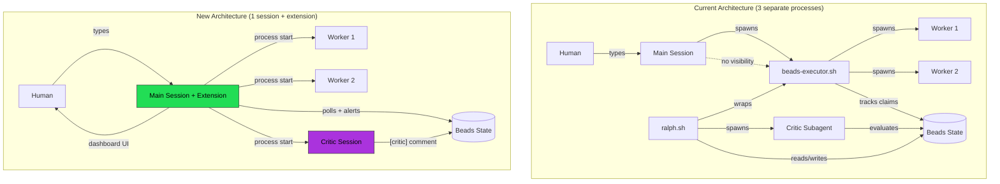
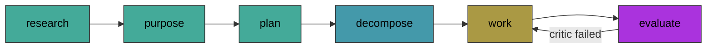
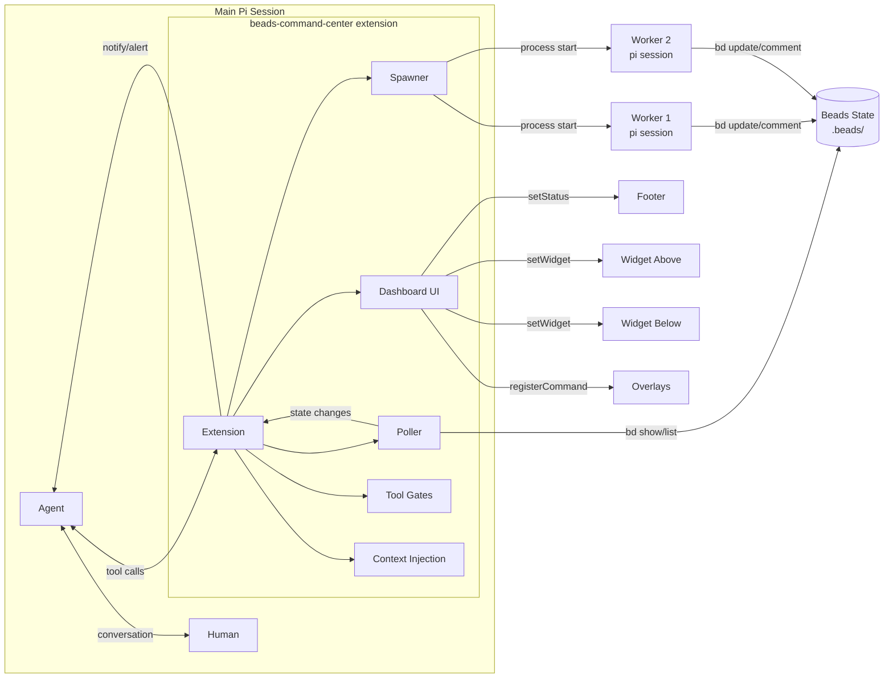
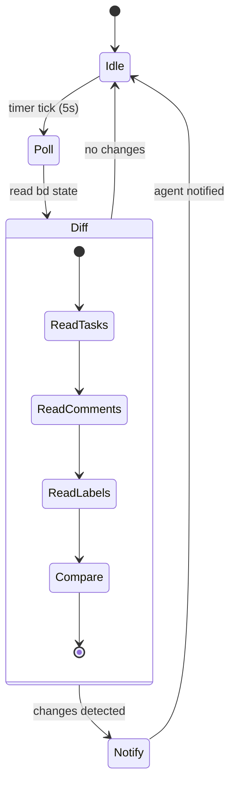
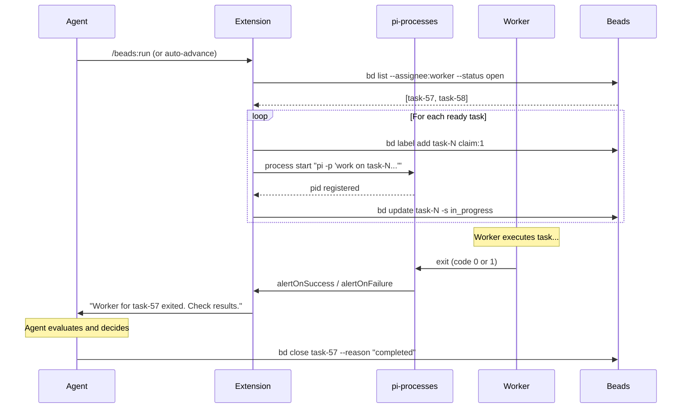
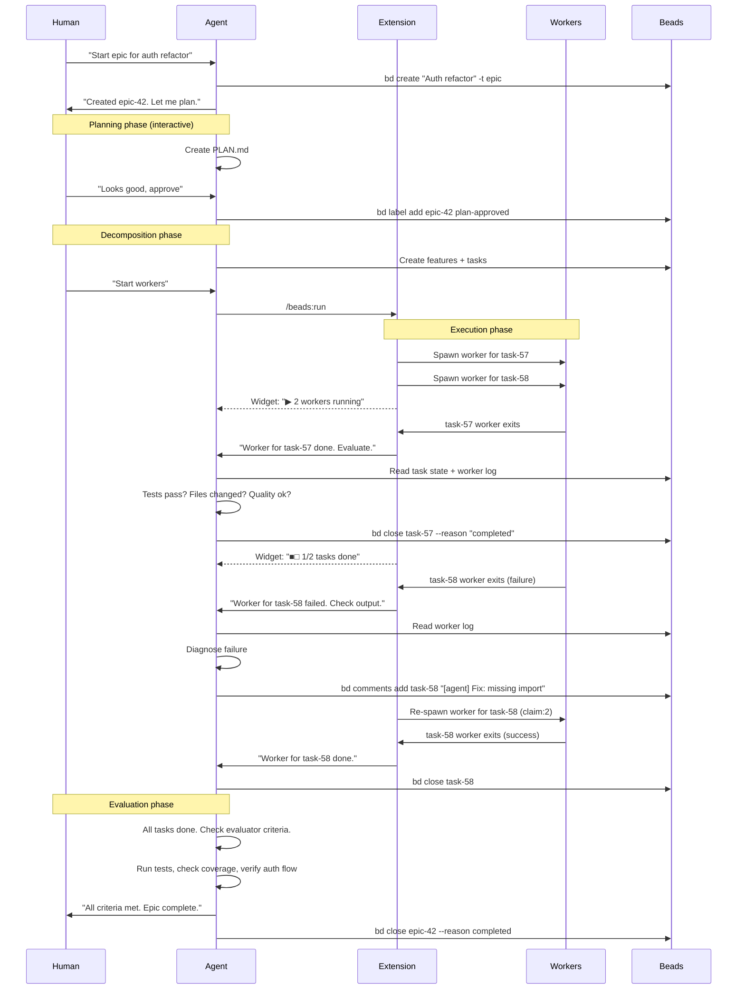
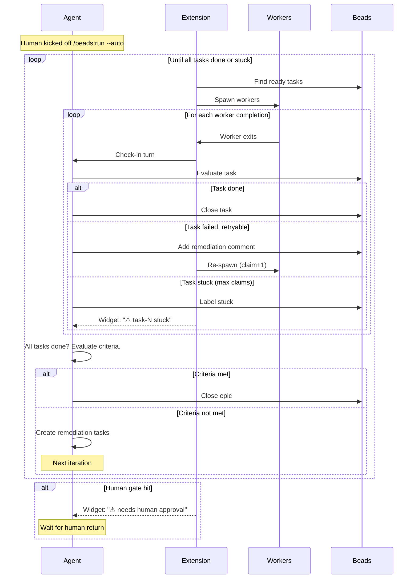

# Beads Command Center — Design Document

## Executive Summary

Beads Command Center is a pi coding agent extension that replaces the standalone `beads-executor.sh` and `ralph.sh` orchestration scripts with an integrated, observable, human-in-the-loop task execution harness. Instead of spawning opaque background processes that run autonomously, the extension keeps the **main agent session as the single orchestrator** — it spawns workers, monitors their progress, evaluates their output, and advances the workflow, all within the pi TUI with full visibility and human control.

The core insight: **the agent in your main session is already the smartest orchestrator you have**. It understands context, reads skills, evaluates quality, and talks to you. The current architecture externalizes orchestration to bash scripts (`beads-executor.sh`, `ralph.sh`) that are mechanical and blind. This extension brings orchestration back into the agent session where it belongs, with the extension handling only the mechanical parts (spawning, polling, notifications) and the agent handling the intelligent parts (evaluation, remediation, phase advancement).



## Phase Model

The extension enforces a linear phase pipeline. Each phase must complete before the next unlocks:



| Phase | Owner | Output | Gate |
|-------|-------|--------|------|
| **research** | Agent + Human (interactive) | `docs/<epic>/RESEARCH.md` | `research-done` label |
| **purpose** | Agent + Human | PURPOSE section in PLAN.md | Implicit (part of plan) |
| **plan** | Agent + Human | `docs/<epic>/PLAN.md` | `plan-approved` label (human) |
| **decompose** | Agent | Beads features + tasks | Tasks exist with `assignee:worker` |
| **work** | Workers (background) | Code changes, test results | All tasks closed |
| **evaluate** | Critic (fresh session) | `[critic]` comment on epic | `critic-satisfied` label (requires all tasks done) |

One directory = one epic. When an epic completes and you want to add more work, reopen it (`bd reopen`) — don't create a new one. On reopen, the extension strips stale `critic-satisfied` so the evaluation gate isn't bypassed.

### Why Research First

Research is the highest-leverage phase. Inaccurate research leads to wrong plans, which lead to wrong implementations, which lead to rework. The protocol:

1. Agent asks clarifying questions — surfaces unknowns early
2. Agent fetches context — code, docs, wiki, existing patterns
3. Agent writes RESEARCH.md — findings, constraints, assumptions
4. Human reviews and corrects — catches wrong assumptions before they propagate
5. Iterate until both are satisfied

Only then does the agent write PURPOSE (why) and PLAN (how).

### Why Critic as Separate Session

The main agent session has been involved in research, planning, and orchestration. It's biased — it discussed the approach, agreed on trade-offs, and watched the work happen. A fresh critic session:

- Starts with zero conversation history
- Only sees: evaluator criteria + task output + test results
- Cannot be influenced by prior discussions
- Evaluates purely on output quality
- Can use a different (cheaper) model

### Artifact Organization

Human-facing artifacts (committable) go in `docs/<epic-name>/`:
```
docs/auth-refactor/
├── RESEARCH.md      # Research findings, constraints, assumptions
├── PLAN.md          # Purpose, approach, risks, acceptance criteria
└── DECISIONS.md     # Optional: key decisions log
```

Machine artifacts (ephemeral, git-ignored) go in `.beads/sessions/<epic>/`:
```
.beads/sessions/epic-42/
├── critic-iter-1.md
├── executor.log
├── worker-task-57.log
└── decompose-iter-1.log
```

The `name:<label>` on the epic maps to the docs directory name.

## Problem Statement

### What exists today

The beads orchestration stack has three layers:

1. **beads-executor.sh** — A bash script that finds ready tasks (`assignee:worker`, `open`), spawns pi worker subagents for each, tracks claim counts, detects stuck tasks, and auto-closes epics when all tasks complete.

2. **ralph.sh** — A bash script that wraps the executor with a Decompose→Work→Evaluate iteration loop. It spawns a critic subagent to evaluate work against `[evaluator]` criteria, manages iteration/phase labels, and exits on `critic-satisfied` or `stuck`.

3. **Worker sessions** — Separate pi processes that load the `sakthisi-beads-work` skill, execute a single task, and (hopefully) update beads state with comments and status changes.

### What's wrong with this

| Problem | Impact |
|---------|--------|
| **Opaque execution** | Executor and ralph run as background bash scripts. No visibility into what's happening without manually tailing log files. |
| **Unreliable workers** | Workers may crash, overflow context, or exit without updating beads state. The executor only detects this via claim counting — it can't evaluate work quality. |
| **Mechanical orchestration** | The executor is a bash loop. It can't make intelligent decisions about task quality, remediation strategy, or phase advancement. It just spawns and counts. |
| **Separate critic** | Ralph spawns a separate pi session just to evaluate. This is expensive (new context, new model call) and disconnected from the orchestrator's understanding. |
| **No human integration** | The executor runs autonomously. Human gates (`assignee:human`) pause execution but there's no UI to surface what needs attention or let the human act inline. |
| **Dual process management** | You manage the executor PID, ralph PID, and worker PIDs separately. Stopping, resuming, and debugging requires manual PID tracking. |
| **Skill conflict** | The beads skill tells the agent to run `beads-executor.sh`. If the extension provides a better execution path, the agent may still try the script because the skill says to. |

### What we want

- **Single session orchestration** — The main agent session is the orchestrator. No separate executor or ralph processes.
- **Observable execution** — Real-time visibility into task progress, worker status, and evaluation results via TUI widgets and overlays.
- **Intelligent check-in** — When a worker completes, the agent evaluates the output and decides next steps (close, reopen, remediate, advance phase).
- **Human-in-the-loop** — Human gates surface in the UI. The human can approve, reject, comment, or override without leaving the session.
- **Managed workers** — Workers spawn via pi-processes with proper alerting. No manual PID tracking.
- **Graceful skill coexistence** — The extension intercepts executor/ralph script calls and redirects to its managed execution path. Skills don't need modification.

## Architecture

### System Overview



### Component Breakdown

#### 1. Poller (`lib/poller.ts`)

Periodically reads beads state via `bd` CLI commands and detects changes.



What it watches:
- Task status changes (open → in_progress → closed)
- New comments (especially `[human]`, `[critic]`, `[worker]`)
- Label changes (stuck, claim:N, critic-satisfied)
- Worker process exits (via pi-processes alerts)
- Epic-level state (iteration, phase)
- Epic reopen (closed → open) — strips stale `critic-satisfied` label and refreshes widgets

What it does NOT do:
- Evaluate work quality (that's the agent's job)
- Advance phases (that's the agent's job)
- Make decisions (it only reports state changes)

#### 2. Spawner (`lib/spawner.ts`)

Manages worker lifecycle via pi-processes.



Worker spawning details:
- Each worker is a pi session with the beads-work skill loaded
- Worker prompt includes: task ID, task description, epic context, session directory
- `alertOnSuccess=true` and `alertOnFailure=true` — agent always gets a turn
- Worker logs go to `.beads/sessions/<epic>/worker-<task>.log`
- Claim tracking: increment `claim:N` label on each spawn attempt
- Stuck detection: if `claim:N` exceeds threshold (default 3), mark task stuck

#### 3. Tool Gates (`index.ts`)

Intercepts commands via `tool_call` event handlers and blocks violations with actionable error messages. Currently enforces 8 gates:

| # | Gate | Trigger | Block Reason |
|---|------|---------|-------------|
| 1 | Script redirect | `beads-executor.sh` in bash | Use `/beads:run` instead |
| 2 | Script redirect | `ralph.sh` in bash | Use extension commands instead |
| 3 | Epic-first | `bd create` without `-t epic` when no epic exists | Create an epic first |
| 4 | Single epic | `bd create -t epic` when epic exists | One epic per directory — reopen if closed |
| 5 | Critic gate | `bd close <epic>` without `critic-satisfied` + all tasks done | Spawn critic via `/beads:evaluate` first |
| 6 | Critic integrity | `bd label add ... critic-satisfied` | Only the critic session can add this label |
| 7 | Plan approval | `bd label add ... plan-approved` without human approval | Human must run `/beads:approve` |
| 8 | No direct work | `write` or `edit` on non-docs files during work phase | Orchestrator can't write code — spawn a worker |

Gates 5 and 6 provide defense in depth: the orchestrator can't close without critic evaluation (gate 5), and can't bypass that by self-labeling `critic-satisfied` (gate 6). The close gate also requires `allTasksDone AND criticSatisfied` — a stale label from a prior iteration can't bypass the gate while new tasks are open.

Gate 4 handles the epic lifecycle: if the epic is closed, the error message guides the agent to `bd reopen` + `bd update --title` instead of creating a new epic.

Skills don't need modification — the extension overrides at the pi level.

#### 4. Context Injection (`index.ts`)

Adds orchestration rules to the system prompt via `before_agent_start`:

```
## Beads Execution Override

Task execution is managed by the beads-command-center extension.
- Do NOT run beads-executor.sh or ralph.sh directly.
- Use /beads:run to spawn workers for ready tasks.
- Use /beads to monitor progress.
- When notified of worker completion, evaluate the output and decide:
  close the task, reopen with feedback, or create remediation tasks.
- Advance to the next phase when all tasks in current phase are done.
- Surface human gates via the dashboard — don't ask the human to run bd commands.
```

#### 5. Dashboard UI (`components/`)

Five UI surfaces:

| Surface | Pi Primitive | Purpose |
|---------|-------------|---------|
| Status line | `setStatus()` | Always-visible epic + phase + progress |
| Progress widget | `setWidget("beads-progress", ..., { placement: "aboveEditor" })` | Compact progress bar |
| Human gate widget | `setWidget("beads-gates", ..., { placement: "belowEditor" })` | Pending human actions |
| Epic panel | `registerCommand("beads")` + overlay | Full task dashboard |

### Execution Flow

#### Attended Mode (human present)



#### Unattended Mode (human away)



## Design Decisions

### D1: Main session as orchestrator (not a separate process)

**Decision:** The agent in the main pi session handles all orchestration logic — evaluation, phase advancement, remediation planning.

**Alternatives considered:**
- Keep ralph.sh as a separate process (status quo)
- Build a new orchestrator daemon in TypeScript
- Use pi subagents for orchestration

**Rationale:** The main agent already has the richest context — it knows the epic plan, the human's preferences, the skill instructions, and the conversation history. Externalizing orchestration to a bash script throws all of this away. The agent can evaluate work quality far better than a mechanical script. The extension handles only what the agent can't: background process management and periodic polling.

**Trade-off:** The main session's context window fills up over long epics. Mitigation: beads state is persistent (labels, comments). If context overflows, the agent can recover by reading beads state. The extension can also summarize completed tasks to reduce context pressure.

### D2: Tool gates over skill modification

**Decision:** Block `beads-executor.sh` and `ralph.sh` via `tool_call` event handler rather than modifying the skills.

**Alternatives considered:**
- Fork the beads/ralph skills with modified instructions
- Add conditional logic in skills ("if extension loaded, use extension")
- Remove executor references from skills entirely

**Rationale:** Skills should be generic and reusable. The extension is the environment-specific override. This follows pi's layering: skills describe capabilities, extensions control how they're used. Other users of the beads skill (without this extension) still get the executor path. The tool gate is explicit, debuggable, and teaches the agent the correct alternative via the block reason.

### D3: pi-processes for worker management

**Decision:** Use the `process` tool (from `@aliou/pi-processes`) to spawn and manage workers.

**Alternatives considered:**
- Direct `child_process.spawn()` in the extension
- `nohup` + PID files (current approach)
- Custom process manager

**Rationale:** pi-processes already handles everything we need: background spawning, log capture, alert-on-exit, process listing, and cleanup. The alert system (`alertOnSuccess`, `alertOnFailure`) is exactly the check-in mechanism we want — the agent gets a turn to react when a worker finishes. No need to build a custom process manager.

### D4: Polling over file watchers

**Decision:** Poll beads state via `bd` CLI commands on a timer (every 5 seconds) rather than using filesystem watchers.

**Alternatives considered:**
- `fs.watch()` on `.beads/` directory
- inotify/kqueue watchers
- Beads daemon events (if available)

**Rationale:** Beads state is spread across git objects, not simple files. `bd` commands are the reliable interface. Polling every 5 seconds is cheap (a few `bd list` calls) and avoids the complexity of filesystem watchers on git-backed storage. The pi-processes alert system handles the latency-sensitive case (worker exit) — polling is only for state that changes via external `bd` commands.

### D5: No forced hats

**Decision:** Do not implement hat-based role switching. Let the model choose its approach naturally.

**Alternatives considered:**
- Grandpa Loop's 13-hat system
- Configurable hat sequences per task
- Hat rotation with emit-based transitions

**Rationale:** The model already knows when to plan, code, test, and review from the skill instructions. Forcing hat sequences adds rigidity without clear benefit. If observability into the model's "phase" is needed, it can be inferred from tool calls (editing = coding, running tests = testing, reading skills = planning) rather than forcing explicit transitions. This avoids the "enterprise framework" trap.

### D6: Critic as fresh separate session

**Decision:** Evaluation is done by a fresh pi session (critic) spawned via pi-processes, not inline by the orchestrator.

**Alternatives considered:**
- Inline evaluation by the main agent (biased by prior context)
- Keep ralph's critic subagent pattern (bash-managed, no extension integration)
- Skip evaluation entirely (trust workers)

**Rationale:** The main agent has been involved in research, planning, and orchestration. It's primed to think the work is good. A fresh critic session starts with zero conversation history and evaluates purely on output quality against the `[evaluator]` criteria. This eliminates confirmation bias. The critic writes a structured `[critic]` comment to beads and exits. The orchestrator reads the verdict and decides next steps. The critic can use a cheaper model (`criticModel` setting) since evaluation is simpler than generation.

### D8: Research-first phase model

**Decision:** Enforce a research phase before planning. The phase pipeline is: research → purpose → plan → decompose → work → evaluate.

**Alternatives considered:**
- Jump straight to planning (status quo)
- Optional research (agent decides)
- Research as part of planning

**Rationale:** Research is the highest-leverage phase. Wrong assumptions in research propagate through planning, decomposition, and implementation — causing rework. Making research explicit and mandatory (with a `research-done` gate) ensures the agent asks questions, fetches context, and validates assumptions before committing to a plan. The widget shows blocked phases as dimmed, making the flow self-documenting — users understand the protocol without tribal knowledge.

### D7: Widget as glanceable summary, overlay as command center

**Decision:** Persistent widgets show status only (not interactive). Overlays handle all interaction.

**Rationale:** Pi widgets (`setWidget`) don't support input handling — they're render-only. The pattern is: widget shows state, user types command to interact. This matches pi-processes' dock pattern and keeps the UI simple. The widget is the "glance," the overlay is the "deep dive."

## Why Pi: Building Agent Applications, Not Configurations

Other coding agent tools have hooks. Claude Code has `PreToolUse`/`PostToolUse`. Kiro CLI has lifecycle events. Most tools let you inject system prompts and define custom slash commands. The difference isn't any single hook — it's how easily they compose into an application.

This extension uses 13 distinct pi APIs in a single file. Event hooks feed into shared state. Tool gates read that state to make decisions. Widgets render it. Commands mutate it. Messages trigger new agent turns based on it. Everything stacks.

### The Patterns That Make This Possible

#### Reactive Phase Advancement via `sendMessage` + `triggerTurn`

The most powerful pattern in this extension is using poller-detected state changes to inject messages that kick the agent into action — without human intervention.

Example: when the poller detects `phase:work` (decompose just completed), it calls:

```typescript
pi.sendMessage({
  customType: "auto-advance-work",
  content: `Decomposition complete — phase:work detected with ${ready.length} ready task(s). Immediately spawn workers via /beads:run.`,
  display: true,
}, { deliverAs: "followUp", triggerTurn: true });
```

The agent gets a new turn, sees the instruction, and spawns workers. No human needed. The same pattern drives the evaluate→remediate loop: `onAllTasksDone` triggers evaluation, `onCriticDone` triggers remediation. The extension creates a self-driving workflow where the agent advances through phases autonomously, with the human only intervening at explicit gates.

This is fundamentally different from a pre-tool hook. It's the extension *initiating* agent behavior based on external state changes, not just reacting to agent actions.

#### Tool Gates as Workflow Guardrails

Tool gates (`tool_call` handlers that return `{ block: true, reason }`) enforce invariants the agent would otherwise violate. The block reason teaches the agent the correct alternative — it self-corrects on the next turn.

The two-layer critic defense is the clearest example:
- **Gate 5** blocks `bd close <epic>` without the critic approval label — the agent can't skip evaluation
- **Gate 6** blocks the agent from self-labeling that approval — the agent can't fake evaluation
- The only path is spawning a fresh critic session that independently decides

No amount of prompt engineering achieves this reliability. The agent *cannot* bypass the gate, regardless of context window pressure, instruction drift, or creative interpretation. It's a hard constraint, not a soft suggestion.

#### Gate 8: Role Separation via Write Blocking

Gate 8 blocks `write`/`edit` on non-docs files during the work phase. This enforces the orchestrator/worker separation — the main session coordinates, workers implement. Even for trivial one-line changes, the orchestrator must spawn a worker. This prevents the "I'll just do it myself" failure mode where the orchestrator accumulates implementation context and loses its coordination perspective.

The gate is path-aware: writes to `docs/`, `.beads/`, and `prompts/` are allowed (orchestrator artifacts). Everything else requires a worker.

#### Stale Label Defense on Epic Reopen

When the poller detects an epic transitioning from closed to open, it automatically strips stale approval labels. This prevents a subtle bug: reopening an epic to add new work would inherit the old critic approval, bypassing evaluation for the new tasks. The extension handles this automatically — no human or agent needs to remember.

### Why This Matters

Any tool can add a pre-tool hook. But can you read shared extension state inside that hook, block the command, surface the reason in a widget, inject a corrective message that triggers a new agent turn, and have the agent self-correct — all without the human typing anything? That's what makes this a 600-line application instead of a 600-line config file.

The stacking is the key. Each API surface is simple. The power comes from composing them: poller detects state → callback fires → `sendMessage` triggers agent turn → agent calls tool → gate validates → widget updates. A closed loop where the extension and agent collaborate as peers, with the human stepping in only at designated gates.


## Comparison: Extension vs. Existing Skills

| Aspect | beads-executor + ralph | beads-command-center extension |
|--------|----------------------|--------------------------|
| **Orchestration** | Bash scripts (mechanical) | Main agent (intelligent) |
| **Visibility** | Tail log files manually | Real-time TUI widgets + overlays |
| **Evaluation** | Separate critic subagent | Agent evaluates inline |
| **Human gates** | Execution pauses silently | Widget surfaces pending actions |
| **Worker management** | Manual PID tracking | pi-processes with alerts |
| **Recovery** | Read labels, restart script | Agent reads beads state, resumes |
| **Iteration loop** | ralph.sh bash loop | Agent-driven check-in cycle |
| **Skill changes needed** | None | None (tool gates redirect) |
| **Process count** | 3+ (main + executor + ralph + workers) | 1 + workers (main session + extension) |
| **Context for decisions** | None (bash has no context) | Full conversation + epic + skills |
| **Cost per evaluation** | Full model call (critic subagent) | Part of existing agent turn |

## File Structure

```
~/.pi/packages/beads-command-center/
├── package.json              # Pi package manifest
├── README.md                 # User-facing documentation
├── DESIGN.md                 # This document
├── index.ts                  # Extension entry: events, commands, gates, prompts
├── lib/
│   ├── beads.ts              # Beads state reader (bd CLI wrapper)
│   └── poller.ts             # State change detection + notifications
└── components/
    └── widgets.ts            # Phase pipeline, status, gates, panels, task detail
```

## Commands Reference

| Command | Phase | Description |
|---------|-------|-------------|
| `/beads` | any | Open epic dashboard overlay |
| `/beads:research` | research | Start research phase — agent asks questions, fetches context |
| `/beads:plan` | plan | Start plan phase (requires `research-done`) |
| `/beads:run` | work | Spawn workers for ready tasks |
| `/beads:evaluate` | evaluate | Spawn fresh critic session |
| `/beads:task <id>` | any | Open task detail overlay |
| `/beads:approve` | plan | Approve pending plan (adds `plan-approved` label) |
| `/beads:comment <id> <text>` | any | Add `[human]` comment to task |
| `/beads:stop` | work | Kill all workers, pause execution |
| `/beads:resume` | work | Resume — re-spawn workers for ready tasks |
## Composability & Extension Stacking

This extension is designed to be one layer in a stack. The vision is specialized agent UX built from composable packages — protocol (beads), skills (portable prompts), and UX (harness-specific extensions). Multiple UX extensions will coexist: a device-flash workflow, a CI/CD validator, a log analyzer, each adding their own gates, widgets, and commands on top of the same beads orchestration substrate.

This section catalogs every pi API surface this extension touches, the conflict potential when other extensions use the same surface, and the design rules for keeping things stackable.

### API Surface Inventory

| API | Usage in this extension | Conflict model |
|-----|------------------------|----------------|
| `pi.on("before_agent_start")` | Appends orchestration protocol to system prompt | **Additive** — multiple handlers append independently. Order undefined. |
| `pi.on("tool_call")` ×2 | 8 tool gates that block commands | **First-block-wins** — if any handler returns `block: true`, the call is blocked. Other handlers don't run. |
| `pi.on("tool_result")` | Detects epic creation mid-session | **Additive** — multiple handlers see the same result. No conflict. |
| `pi.on("session_start")` | Initializes widgets, footer, poller | **Additive** — but UI primitives called inside can conflict (see below). |
| `pi.registerCommand()` ×10 | `/beads`, `/beads:run`, etc. | **Namespace collision** — two extensions registering the same command name will conflict. |
| `pi.sendMessage()` ×4 | Injects follow-up messages that trigger agent turns | **Additive but noisy** — multiple extensions injecting messages can overwhelm the agent or create conflicting instructions. |
| `ctx.ui.setWidget()` ×2 | Pipeline (above) + gates (below editor) | **ID collision** — same widget ID overwrites. Different IDs coexist. |
| `ctx.ui.setFooter()` ×1 | Custom footer replacing built-in | **Last-write-wins** — only one footer can exist. Multiple extensions calling this will fight. |
| `ctx.ui.setStatus()` | Status line in footer | **Key-scoped** — each extension uses a unique key ("beads"). Multiple keys coexist in the footer. Safe. |
| `ctx.ui.setEditorText()` ×6 | Pre-loads phase prompts into editor | **Last-write-wins** — if two extensions set editor text in the same turn, one is lost. |
| `ctx.ui.notify()` ×20 | Notifications for task events | **Additive** — notifications stack. No conflict, but can be noisy. |
| `ctx.ui.custom()` ×2 | Overlay dashboards | **Modal** — overlays take focus. Only one at a time. Sequential, not conflicting. |

### Conflict Zones & Mitigations

#### 1. Tool Gates: First-Block-Wins

When multiple extensions register `tool_call` handlers, pi runs them in registration order. The first handler that returns `block: true` stops execution — other handlers never see the call.

This means gate ordering matters. If a device-flash extension wants to block `bash` commands that touch `/dev/tty*`, and beads-command-center blocks `bash` commands containing `beads-executor.sh`, the first registered handler wins.

**Design rule:** Gates should be narrow and non-overlapping. Each extension should only gate commands in its own domain. Beads gates check for `bd` commands and `beads-executor.sh`/`ralph.sh`. A device extension should gate `flash`, `adb`, `serial` commands. If domains overlap, the extensions need explicit coordination — either a shared gate registry or a priority system.

**Current risk:** Gate 8 (no direct work) blocks ALL `write`/`edit` calls on non-docs files during work phase. This is broad — a device-flash extension that needs to write config files would be blocked. Mitigation: make the path allowlist configurable, or let extensions register "exempt" paths.

#### 2. Footer: Single Owner

`setFooter()` replaces the entire footer. Only one extension can own it. This extension currently replaces the built-in footer with a custom one that renders extension statuses.

**Design rule:** Don't call `setFooter()`. Use `setStatus(key, text)` instead — it's key-scoped and stackable. Multiple extensions can each set their own status key and they all render in the footer without conflict.

**Action needed:** This extension should migrate from `setFooter()` to relying solely on `setStatus("beads", ...)`. The custom footer was added to render all extension statuses, but that's the built-in footer's job. Remove the `setFooter()` call and let the default footer handle layout.

#### 3. System Prompt: Additive but Unbounded

`before_agent_start` handlers each append to the system prompt. With multiple extensions, the prompt grows. At some point it hits context limits or degrades model performance.

**Design rule:** Keep injected prompt text minimal. This extension injects ~800 tokens of orchestration rules. Each additional extension should budget its prompt injection. Consider a shared prompt budget (e.g., 2000 tokens total for all extensions) and prioritize by relevance to the current phase.

**Future consideration:** Extensions could check the current phase and only inject relevant rules. During research phase, the device-flash extension doesn't need to inject flashing instructions.

#### 4. sendMessage: Conflicting Instructions

`sendMessage` with `triggerTurn: true` injects a message and kicks the agent into a new turn. If two extensions both inject messages in the same cycle, the agent sees two potentially conflicting instructions.

**Design rule:** Use `triggerTurn: true` sparingly. Prefer `notify()` for informational updates and reserve `sendMessage` for phase transitions that require agent action. If multiple extensions need to trigger turns, they should coordinate through beads state (labels, comments) rather than racing to inject messages.

#### 5. Widget IDs: Namespace Your Keys

Widgets are identified by string IDs. Two extensions using the same ID will overwrite each other.

**Design rule:** Prefix widget IDs with the package name. This extension uses `"beads-pipeline"` and `"beads-gates"`. A device extension should use `"device-status"`, `"device-flash-progress"`, etc.

**Placement matters:** Both `aboveEditor` and `belowEditor` slots can hold multiple widgets. They render in registration order. Too many widgets shrink the editor area. Extensions should be conservative — one widget each, collapsible when not relevant.

#### 6. setEditorText: Last-Write-Wins

Multiple extensions pre-loading prompts into the editor will fight. Only the last write survives.

**Design rule:** Only the orchestration layer (this extension) should call `setEditorText()`. Specialized extensions should surface their prompts through `notify()` or `sendMessage()` and let the orchestrator decide what goes in the editor. Alternatively, use a queue pattern — extensions push prompt suggestions, the orchestrator picks the highest-priority one.

#### 7. Command Namespaces

All 10 commands in this extension use the `beads:` prefix. This is the namespace convention.

**Design rule:** Every extension gets a prefix. `beads:*` for orchestration, `device:*` for device workflows, `ci:*` for CI/CD, `log:*` for log analysis. The bare `/beads` command is the dashboard entry point — each extension gets one bare command for its dashboard.

#### 8. Overlays: Sequential, Not Concurrent

`ctx.ui.custom()` takes over the screen. Only one overlay can be active. This is inherently sequential — no conflict, but extensions should not hold overlays open for long periods.

**Design rule:** Overlays are for quick interactions (dashboards, confirmations, selections). Long-running status belongs in widgets. Don't block the agent loop with an open overlay.

### Stacking Architecture

The target architecture for multiple specialized extensions:

```
┌────────────────────────────────────────────────────────────────────────┐
│  pi session                                                            │
│                                                                        │
│  ┌──────────────────────────────────────────────────────────────────┐  │
│  │  Widgets (above editor)                                            │  │
│  │  ┌────────────────────┐ ┌────────────────────┐ ┌──────────────────┐  │  │
│  │  │ beads-pipeline     │ │ device-status      │ │ ci-status        │  │  │
│  │  └────────────────────┘ └────────────────────┘ └──────────────────┘  │  │
│  └──────────────────────────────────────────────────────────────────┘  │
│                                                                        │
│  ┌──────────────────────────────────────────────────────────────────┐  │
│  │  Tool Gates (stacked, narrow domains)                              │  │
│  │  beads: bd commands, write/edit during work phase                  │  │
│  │  device: flash, adb, serial commands                              │  │
│  │  ci: deploy, release, publish commands                            │  │
│  └──────────────────────────────────────────────────────────────────┘  │
│                                                                        │
│  ┌──────────────────────────────────────────────────────────────────┐  │
│  │  Footer (built-in, not overridden)                                │  │
│  │  setStatus("beads", ...) + setStatus("device", ...) + ...         │  │
│  └──────────────────────────────────────────────────────────────────┘  │
│                                                                        │
│  Commands: /beads:* │ /device:* │ /ci:* │ /log:*                      │
└────────────────────────────────────────────────────────────────────────┘
```

### Design Rules for New Extensions

When building a new package that stacks with beads-command-center:

1. **Namespace everything** — commands (`prefix:*`), widget IDs (`prefix-*`), status keys (`prefix`)
2. **Don't call `setFooter()`** — use `setStatus(key, text)` for stackable footer presence
3. **Keep gates narrow** — only intercept commands in your domain. Check command content precisely, don't match broad patterns
4. **Don't call `setEditorText()`** — use `sendMessage()` or `notify()` to surface prompts. Let the orchestration layer own the editor
5. **Budget your system prompt injection** — keep `before_agent_start` additions under 500 tokens. Consider phase-gating (only inject when relevant)
6. **Use `triggerTurn` sparingly** — prefer `notify()` for status updates. Reserve `sendMessage` with `triggerTurn: true` for actions that require agent response
7. **Coordinate through beads state** — use labels and comments on tasks/epics as the shared coordination substrate, not extension-to-extension messaging
8. **Respect the orchestrator role** — beads-command-center is the orchestrator. Specialized extensions add domain-specific gates, widgets, and commands but don't try to drive the phase pipeline
9. **Prefer natural language over slash commands** — only register commands for mechanical actions the agent can't do (human gates, process spawning, UI dashboards). Phase transitions like "start research" or "write the plan" are better handled by the agent from natural language input. Don't wrap `setEditorText` in a slash command when the user can just type what they want

### Known Action Items for Stackability

- [ ] **Migrate off `setFooter()`** — this extension currently replaces the built-in footer. Should use `setStatus()` only and let the default footer render all extension statuses
- [ ] **Make gate 8 path allowlist configurable** — the "no direct work" gate blocks all `write`/`edit` outside docs/. Other extensions may need to write config files, device manifests, etc. Add an allowlist in `settings.json`
- [ ] **Phase-gate system prompt injection** — only inject orchestration rules relevant to the current phase, reducing prompt bloat when multiple extensions are loaded
- [ ] **Add extension event bus** — pi supports `pi.events` for inter-extension communication. Use this for coordination instead of relying on shared beads state for time-sensitive signals
- [ ] **Widget visibility API** — widgets should auto-hide when not relevant (e.g., device-status widget hides when not in work phase, beads-pipeline collapses to single line when phase is stable)

## Future Considerations

- **Context summarization** — When the main session's context fills up, auto-summarize completed tasks and inject the summary. Beads comments serve as persistent memory.
- **Multi-epic support** — Dashboard can show multiple epics. Status line cycles or shows the active one.
- **Worker skill loading** — Workers could load different skill sets based on task type (e.g., `build` skill for build tasks, `log-analysis` for log analysis).
- **Metrics collection** — Track time-per-task, claims-per-task, iterations-per-epic for tuning insights.
- **Dependency graph visualization** — ASCII DAG of task dependencies in an overlay.
- **Remote workers** — Spawn workers on remote machines via SSH for hardware-dependent tasks (e.g., embedded device testing).

## TODO / Next Steps

Items for a follow-up agent to pick up. Ordered roughly by impact.

### P0 — Test & Harden

- [ ] End-to-end test: create epic, run through all phases, verify widget updates at each transition
- [ ] Test tool gates: confirm all 8 gates fire correctly (script redirects, epic-first, single epic/reopen, critic gate, critic integrity, plan approval, no direct work)
- [ ] Test poller: verify notifications fire on task completion, stuck detection, human gate changes
- [ ] Test critic spawn: verify fresh session has no prior context, writes `[critic]` comment, exits cleanly
- [ ] Handle edge cases: no `.beads/` dir, `bd` not installed, epic with no tasks, worker crash mid-task
- [ ] Verify `questionnaire` tool works during research phase for structured clarifying questions

### P1 — UI & Querying Efficiency

- [ ] **Replace `bd` CLI polling with file watcher** — Currently `getEpicState` makes 4-7 `execSync("bd ...")` calls every 5 seconds, each spawning a process and opening the SQLite DB. Perles solves this with a file watcher on `beads.db-wal` (SQLite) or `last-touched` (Dolt), only re-querying when data changes. Adopt the same pattern:
  ```
  // From perles: internal/beads/adapter/backend.go
  // SQLite mode: watch database and WAL files
  WatcherConfig{
    RelevantFiles:    []string{"beads.db", "beads.db-wal"},
    DebounceDuration: 100 * time.Millisecond,
  }
  ```
  Use `fs.watch(".beads/beads.db-wal")` in Node.js with debounce. Only call `bd` when the file changes. Eliminates 99% of wasted process spawns.

- [ ] **Reduce `bd` calls per state read** — `getEpicState` currently makes separate calls for `show`, `list --parent (features)`, `list --parent (tasks per feature)`, `comments`. Collapse to fewer calls:
  - One `bd list --parent <epic> --all --json` for all children (features + tasks)
  - One `bd comments <epic>` for evaluator/critic comments
  - Filter by type in JS instead of making N queries

- [ ] **Perles daemon as query backend** — `perles daemon --port <N>` exposes a REST API with BQL query support, event subscriptions, and workflow management. Instead of shelling out to `bd`, query the daemon:
  ```
  // Single BQL query replaces 4-7 bd calls:
  GET /api/query?q=parent:<epicId>+AND+status:open
  ```
  See: https://github.com/zjrosen/perles — `cmd/daemon.go`, `internal/beads/adapter/query_executor.go`

- [ ] **Delegate overlay to perles web frontend** — Perles bundles a web frontend (`frontend/dist/`) served by the daemon. Instead of rebuilding a dashboard in pi's limited TUI primitives, the `/beads` command could:
  - Start `perles daemon` as a sidecar if not running
  - Open `http://localhost:<port>` in the browser
  - Show a minimal text summary in the pi overlay with a link to the full dashboard
  This avoids fighting pi-tui's limited component set (no interactive lists, no scroll, no `DynamicBorder`) and leverages perles' mature kanban board, BQL search, dependency explorer, and workflow management UI.

- [ ] **Compact pipeline widget** — Single-line mode for narrow terminals: `✓✓✓✓▶○ 4/7`
- [ ] **Widget auto-hide** — Collapse pipeline to single line when phase is stable (no transitions in last 30s)

### P2 — Orchestration Improvements

- [ ] **Auto-advance mode** — When `autoAdvance: true`, extension automatically spawns workers after decompose, spawns critic after all tasks done, creates remediation tasks after failed evaluation. Human only intervenes on gates.
- [ ] **Worker wrapper script** — Instead of raw `pi -p`, spawn via a wrapper that: sets up beads context, captures exit status, writes `.beads/sessions/<epic>/worker-<task>.status` with exit code + last 50 lines. Orchestrator reads status file during check-in for reliable evaluation even if worker crashed.
- [ ] **Claim escalation** — After N failed claims, auto-escalate: change `assignee:worker` to `assignee:human`, notify via widget
- [ ] **Parallel worker limits** — Setting for max concurrent workers (default: 3). Queue excess tasks.
- [ ] **Worker timeout** — Kill workers that exceed a configurable time limit per task
- [ ] **Critic model selection** — Use `criticModel` setting to spawn critic with a different (potentially cheaper) model
- [ ] **Iteration history in overlay** — Show past iteration results: which criteria passed/failed per iteration, what remediation was done

### P3 — Research Phase Enhancements

- [ ] **Structured research template** — `/beads:research` creates RESEARCH.md with pre-filled sections (Problem Statement, Current State, Findings, Constraints, Open Questions, Assumptions) so the agent fills in rather than free-forms
- [ ] **Auto-context gathering** — During research, agent automatically: reads relevant code (`my code search`), searches wiki (`my wiki search`), checks existing patterns. Extension could suggest searches based on epic title.
- [ ] **Research completeness check** — Before allowing `research-done`, verify RESEARCH.md has all required sections filled, open questions are resolved, assumptions are flagged
- [ ] **Questionnaire integration** — Agent uses `questionnaire` tool to ask structured clarifying questions during research. Extension could suggest common question patterns based on epic type.

### P4 — Artifact & Reporting

- [ ] **Epic summary generation** — On epic completion, auto-generate a summary doc in `docs/<epic>/SUMMARY.md` with: timeline, iterations, key decisions, final critic verdict
- [ ] **Diff report** — Show what files changed across all tasks in the epic
- [ ] **Time tracking** — Record phase durations, task durations, iteration counts. Surface in `/beads` overlay.
- [ ] **Export** — `/beads:export` generates a standalone markdown report of the epic for sharing
- [ ] **Widget background color** — Custom render object with ANSI bg codes has no visible effect. Investigate pi TUI widget rendering pipeline.
